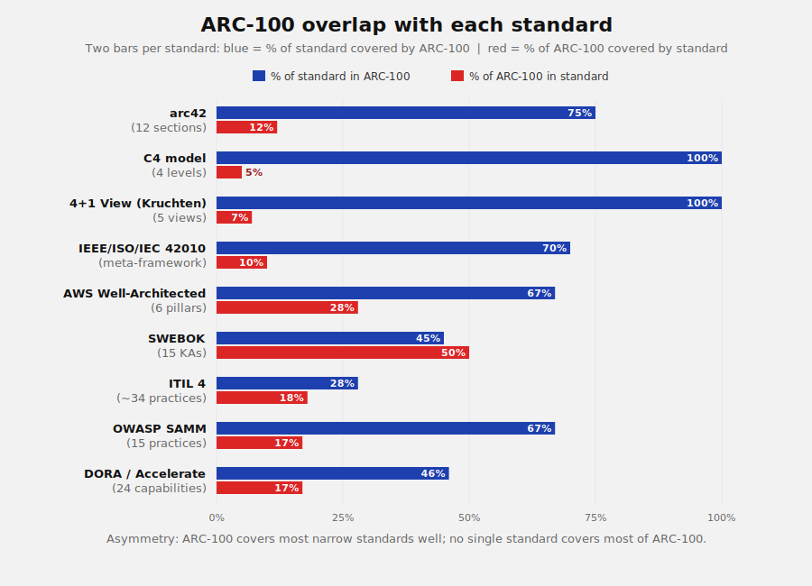
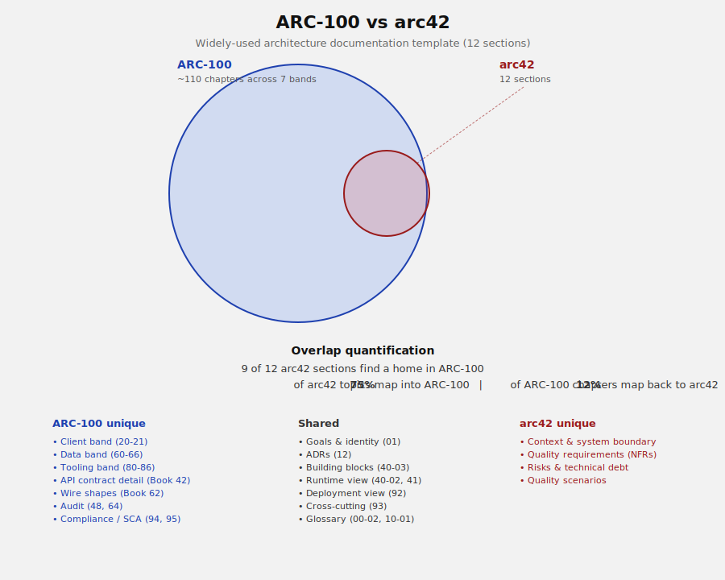
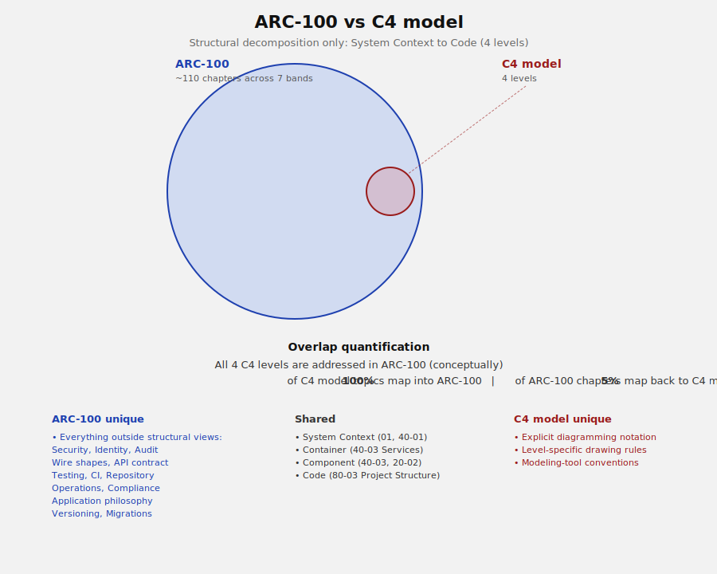
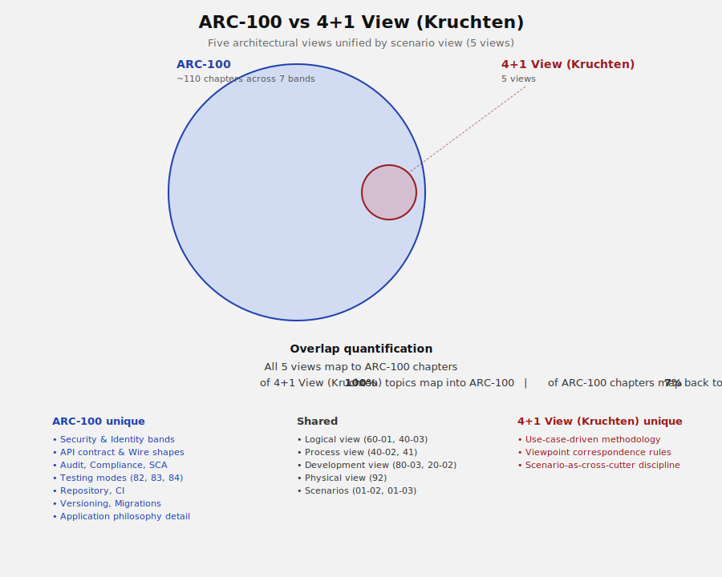
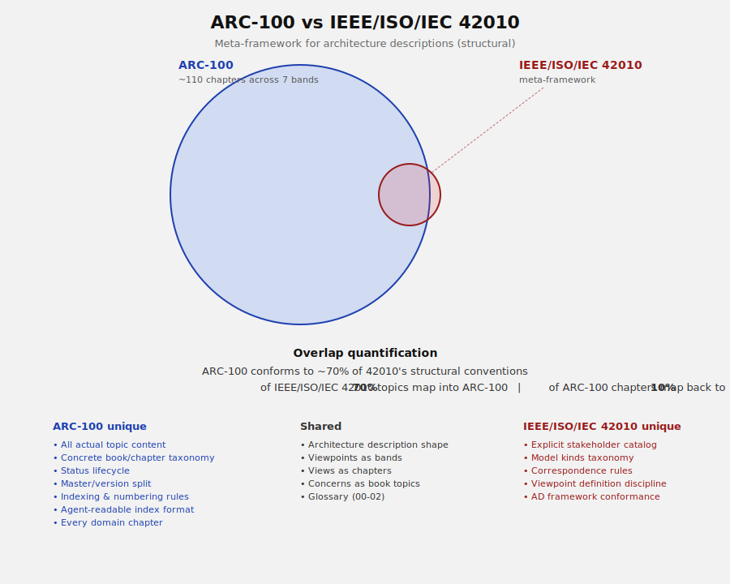
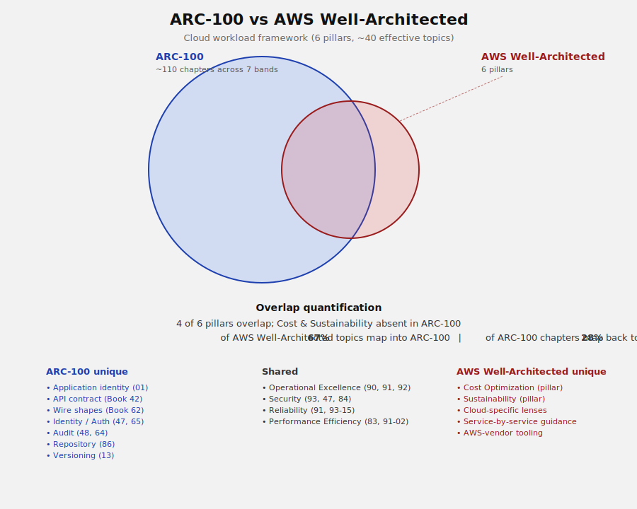
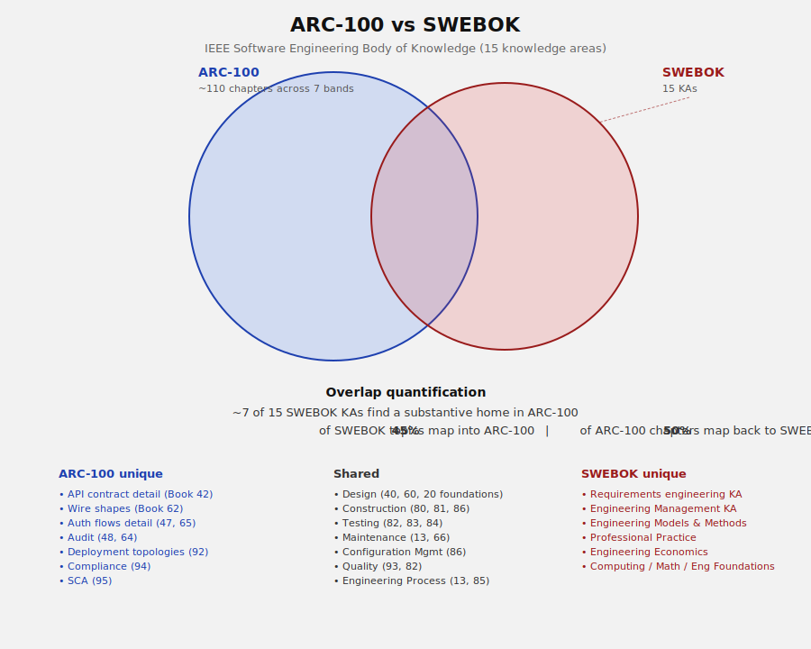
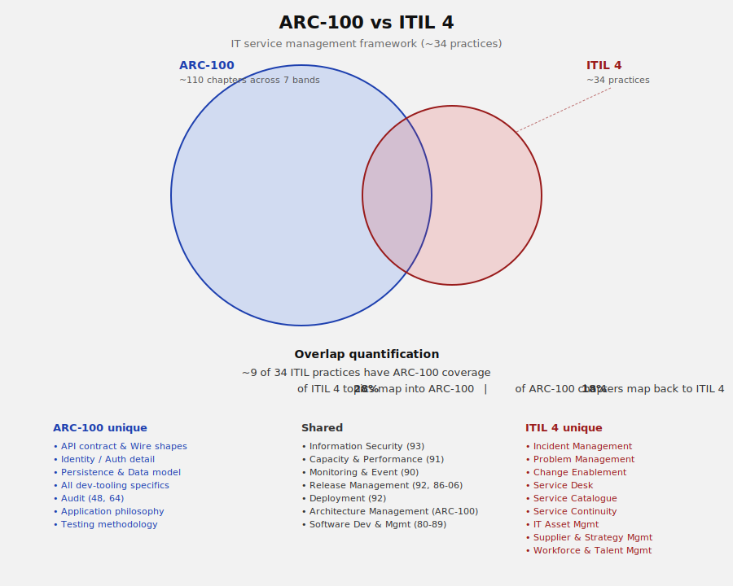
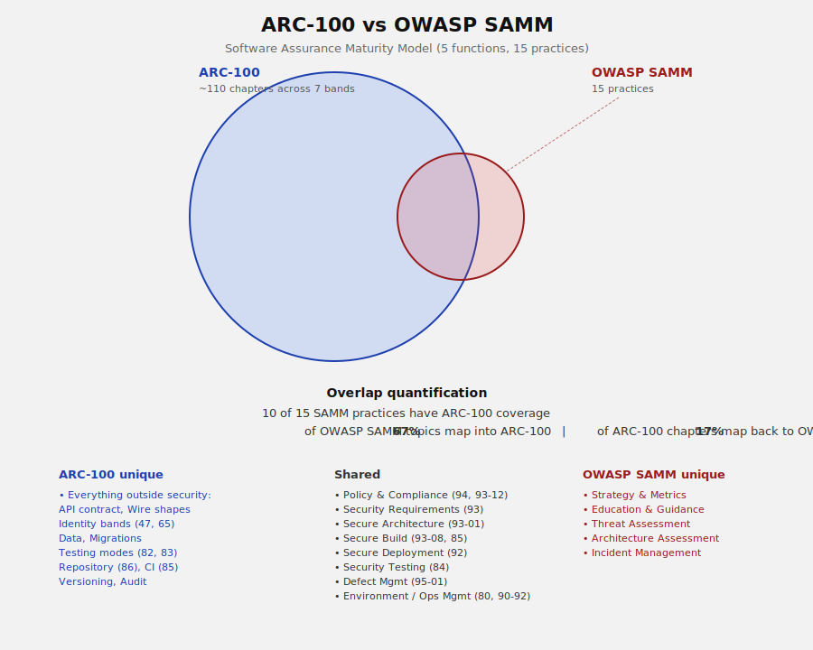
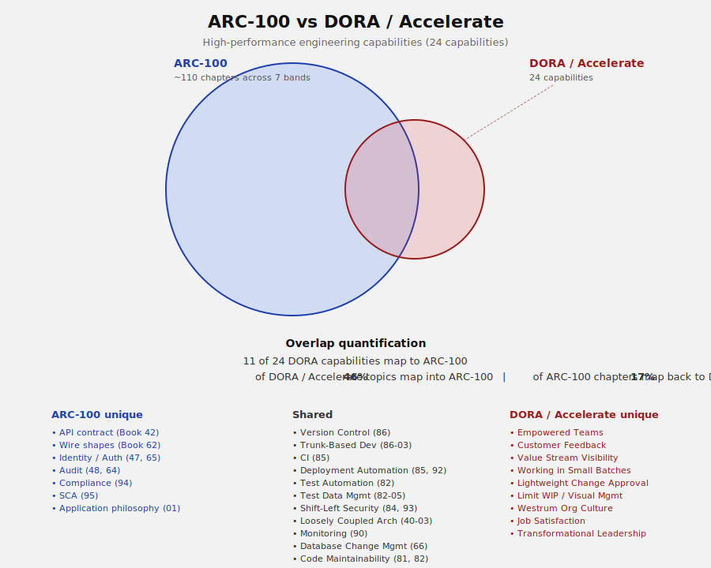

## 00-04 ARC-100 Standards Comparisons

> **What this chapter is.** A snapshot of how ARC-100 relates to nine
> widely-cited industry standards. For each: a one-paragraph intent,
> the maintaining body, the current revision, a quantified overlap
> diagram, and a short analysis. The chapter exists so that anyone
> evaluating ARC-100 can quickly see what neighbouring standards do
> the same thing, what they do differently, and what they don't do at
> all.
>
> **What this chapter is not.** An endorsement of any standard, a
> migration guide, or a normative ruling on which gaps ARC-100 must
> close. Topic-adoption decisions live in plans and are tracked in
> [`12 Decisions`](00-01_ARC-100_Standard_Inventory.md). This chapter is
> informational input to those decisions.
>
> **Maintenance.** Both the standards landscape and the ARC-100 index
> change over time. Re-evaluate this chapter periodically using the
> `/reassess-standards-comparisons` slash command (defined under
> `.claude/commands/` at the repository root), which fetches fresh
> information about each standard, regenerates the diagrams via
> [`assets/comparisons/generate_comparisons.py`](assets/comparisons/generate_comparisons.py),
> and updates this chapter.

### 00-04.1 — Methodology

The comparison for each standard follows the same four-step process:

1. **Enumerate the standard's topic units.** Sections (arc42), levels
   (C4), views (4+1), pillars (AWS Well-Architected), knowledge areas
   (SWEBOK), practices (ITIL, OWASP SAMM), capabilities (DORA), or
   meta-elements (ISO/IEC/IEEE 42010).
2. **Map each unit to an ARC-100 chapter.** "Addresses substantively"
   is the bar — a sentence-deep mention does not count.
3. **Compute two overlap percentages.** *(a)* The percentage of the
   standard's units covered by ARC-100. *(b)* The percentage of
   ARC-100 chapters that map back to the standard.
4. **Visualise.** Two circles, areas proportional to topic count,
   positioned so the visual overlap reflects the smaller of the two
   percentages.

The diagrams are generated by
[`assets/comparisons/generate_comparisons.py`](assets/comparisons/generate_comparisons.py)
from a single data structure listing topic counts, percentages, and
the bulleted "ARC-100-only / shared / standard-only" lists per
standard. Adjust the data structure and re-run the script to
regenerate.

### 00-04.2 — Summary

| Standard | Topic units | % of standard in ARC-100 | % of ARC-100 in standard |
| --- | --- | --- | --- |
| arc42 | 12 sections | 75% | 12% |
| C4 model | 4 levels | 100% | 5% |
| 4+1 view (Kruchten) | 5 views | 100% | 7% |
| ISO/IEC/IEEE 42010 | meta-framework | 70% (structural) | 10% |
| AWS Well-Architected | 6 pillars | 67% | 28% |
| SWEBOK | 15 knowledge areas | 45% | 50% |
| ITIL 4 | ~34 practices | 28% | 18% |
| OWASP SAMM | 15 practices | 67% | 17% |
| DORA / Accelerate | 24 capabilities | 46% | 17% |

The asymmetry is the headline. ARC-100 covers most of the narrow
architecture standards (C4, 4+1, arc42) close to completely, shares
roughly half its scope with SWEBOK, and overlaps modestly with the
practice-oriented standards (SAMM, DORA, AWS Well-Architected, ITIL).
No single standard covers more than half of ARC-100, because ARC-100
spans application identity, client/server/data structure, tooling,
and operations in one taxonomy.

### 00-04.3 — arc42

| | |
| --- | --- |
| **Intent** | A pragmatic, methodology-neutral template for documenting a single project's software architecture. Twelve named sections you fill in for your project. |
| **Maintainer** | Dr. Peter Hruschka and Dr. Gernot Starke, with backing from innoq. |
| **Current revision** | No formal version number; the site shows continuous evolution. Twentieth-anniversary materials were noted in 2026. |
| **URL** | [arc42.org](https://arc42.org/) |
| **Maintenance** | Actively maintained. |

**How it differs from ARC-100.** arc42 is a *template* — twelve
prescribed sections that one project fills in. ARC-100 is an *indexing
standard* — a numbered chapter taxonomy that organises documentation
across many bands and books, deliberately broader than any single
project will use. An arc42 document fits inside one or two chapters
of ARC-100; ARC-100 in turn far exceeds arc42's twelve sections.

**Overlap.** Nine of arc42's twelve sections find a substantive home
in ARC-100: goals (Book 01), decisions (Book 12), building blocks
(40-03), runtime view (40-02 plus Book 41), deployment view (Book
92), cross-cutting concepts (Book 93), constraints (Book 80), and
the glossary (00-02, 10-01). Three arc42 sections — context-and-scope,
quality requirements (non-functional requirements), and
risks-and-technical-debt — currently have no first-class home in
ARC-100. Quality scenarios are likewise not directly chaptered.

### 00-04.4 — C4 model

| | |
| --- | --- |
| **Intent** | A developer-friendly hierarchical *diagramming* approach: System Context → Container → Component → Code. Four levels of zoom. |
| **Maintainer** | Simon Brown. |
| **Current revision** | No formal version. Continuously maintained; a recent O'Reilly book and ongoing community engagement. |
| **URL** | [c4model.com](https://c4model.com/) |
| **Maintenance** | Actively maintained. |

**How it differs from ARC-100.** C4 is *notation and convention for
diagrams*. ARC-100 has no opinion on diagrams. The two are orthogonal:
a project using ARC-100 could draw every diagram in C4 style, or in
no style at all, and ARC-100 is unchanged either way.

**Overlap.** All four C4 levels are conceptually addressed in
ARC-100's foundation chapters (`01 Philosophy`, `40-03 Internal
Services`, `20-02 Module Structure`, `80-03 Project Structure`), but
ARC-100 specifies the topics those chapters should describe, not the
visual notation. There is essentially nothing in C4 worth adopting
into ARC-100 as a chapter — what C4 brings is a diagramming
convention that any individual project can adopt freely on top of
ARC-100.

### 00-04.5 — 4+1 architectural view model (Kruchten)

| | |
| --- | --- |
| **Intent** | An architectural framework based on multiple, concurrent views — Logical, Process, Development, Physical, plus Scenarios as the "+1" tying them together. |
| **Maintainer** | Originally Philippe Kruchten; no active maintainer. |
| **Current revision** | November 1995, IEEE Software vol. 12 no. 6. No revisions. |
| **URL** | [Wikipedia: 4+1 architectural view model](https://en.wikipedia.org/wiki/4%2B1_architectural_view_model) |
| **Maintenance** | Legacy. Widely cited; informally succeeded by ISO/IEC/IEEE 42010 and C4. |

**How it differs from ARC-100.** 4+1 organises documentation around
*views* — different lenses on the same system. ARC-100 organises
documentation around *topics* — concrete subject areas that get their
own chapter regardless of which "view" they belong to. A 4+1
document's Logical View, for example, blends data model and service
decomposition; ARC-100 splits those into Book 60 and Book 40-03.

**Overlap.** All five 4+1 views map to ARC-100 chapters. The model's
contribution to ARC-100 is largely historical: it established that an
architecture description needs multiple coordinated views, which
ARC-100 inherits via its band structure. Nothing in 4+1 is worth
adopting as a new ARC-100 chapter; its concepts are already absorbed.

### 00-04.6 — ISO/IEC/IEEE 42010

| | |
| --- | --- |
| **Intent** | An international standard specifying *what an architecture description must contain* — stakeholders, concerns, viewpoints, views, model kinds, correspondence rules — so that one AD can be compared meaningfully against another. |
| **Maintainer** | ISO, IEC, and IEEE jointly. |
| **Current revision** | 2022 (second edition, November 2022). Supersedes the 2011 edition; introduces "entity of interest" terminology aligning with the 42020 / 42030 family. |
| **URL** | [ISO/IEC/IEEE 42010:2022](https://www.iso.org/standard/74393.html) · [IEEE 42010](https://standards.ieee.org/ieee/42010/6846/) |
| **Maintenance** | Actively maintained. |

**How it differs from ARC-100.** 42010 is a *meta-framework* — it
specifies the requirements an architecture description should meet,
not the topics. ARC-100 is a concrete realisation of an AD that
broadly conforms to 42010 (bands act as viewpoints, chapters as
views, the index encodes concerns and correspondence) without being
explicit about it.

**Overlap.** Structural conformance is high; topical overlap is low,
since 42010 prescribes shape rather than content. What ARC-100 could
adopt from 42010 is an explicit *stakeholder catalog* and explicit
*viewpoint definitions* — currently both implicit in the band and
chapter structure.

### 00-04.7 — AWS Well-Architected Framework

| | |
| --- | --- |
| **Intent** | A consistent approach for evaluating cloud workloads against six pillars — Operational Excellence, Security, Reliability, Performance Efficiency, Cost Optimization, Sustainability. Used by AWS customers as a self-assessment tool against AWS-flavoured best practice. |
| **Maintainer** | Amazon Web Services. |
| **Current revision** | Six pillars (Sustainability added in 2021). The framework receives ongoing pillar refresh; no single version date is published. |
| **URL** | [aws.amazon.com/architecture/well-architected](https://aws.amazon.com/architecture/well-architected/) |
| **Maintenance** | Actively maintained. |

**How it differs from ARC-100.** AWS Well-Architected is an
*evaluation framework* tied to a cloud vendor's best practices.
ARC-100 is *documentation organisation*, vendor-neutral. The two have
different purposes — one to score an existing workload, the other to
organise an existing or planned application's documentation.

**Overlap.** Four of six pillars are well-covered: Operational
Excellence (Books 90–92), Security (Book 93 plus 47, 84), Reliability
(91 plus 93-15), Performance Efficiency (Book 83 plus 91-02). Two
pillars — Cost Optimization and Sustainability — have no current home
in ARC-100. Both are worth deliberation; see the recommendations
discussion in the project's working notes rather than this chapter.

### 00-04.8 — SWEBOK (Software Engineering Body of Knowledge)

| | |
| --- | --- |
| **Intent** | A consensus catalog of the software-engineering discipline. Used by IEEE for curriculum development, certification (CSDP, CSDA), and professional licensing. Fifteen knowledge areas spanning requirements through professional practice and economics. |
| **Maintainer** | IEEE Computer Society. |
| **Current revision** | SWEBOK v4.0a published 25 September 2025 (minor revision to the 2024 v4.0). Version 5.0 in development. |
| **URL** | [IEEE Computer Society — Body of Knowledge](https://www.computer.org/education/bodies-of-knowledge/software-engineering) |
| **Maintenance** | Actively maintained. |

**How it differs from ARC-100.** SWEBOK is a *knowledge catalog* for
the discipline of software engineering. It is academic-flavoured,
designed to define what a software engineer should know. ARC-100 is
*deliverable documentation organisation* for an individual project.
SWEBOK enumerates topics one studies; ARC-100 enumerates topics one
writes about for one's own application.

**Overlap.** This is the closest peer in scope — roughly 45% / 50%
two-way overlap. Seven of SWEBOK's fifteen knowledge areas have
substantive ARC-100 homes: Design, Construction, Testing, Maintenance,
Configuration Management, Quality, Engineering Process. Eight do not:
Requirements Engineering, Engineering Management, Engineering Models
& Methods, Professional Practice, Engineering Economics, and the
three Foundations (Computing, Mathematical, Engineering). Of those,
Requirements Engineering is the most notable gap for ARC-100.

### 00-04.9 — ITIL

| | |
| --- | --- |
| **Intent** | A framework for IT service management — running an IT organisation that delivers services to a business. Practices like incident management, change enablement, service desk, supplier management, capacity, and continuity. |
| **Maintainer** | PeopleCert (formerly Axelos). |
| **Current revision** | **ITIL Version 5** released February 2026, evolving the framework for AI-enabled and product-centric service delivery. ITIL 4 (2019) remains supported. The Venn comparison was performed against ITIL 4's practice catalog (~34 practices) and should be re-run once ITIL 5's practice catalog is publicly cataloged. |
| **URL** | [peoplecert.org — ITIL](https://www.peoplecert.org/) |
| **Maintenance** | Actively maintained. |

**How it differs from ARC-100.** ITIL governs *running an IT service
organisation*. ARC-100 documents *building an individual application*.
The overlap is real — both touch capacity, monitoring, deployment,
release, security — but most of ITIL (incident management, problem
management, service desk, service catalogue, supplier management,
workforce, strategy) is organisational concerns deliberately outside
ARC-100's scope.

**Overlap.** Roughly 9 of 34 ITIL practices have ARC-100 coverage.
The shared territory is what one might call "the engineering /
operations boundary": Information Security, Capacity & Performance,
Monitoring, Release Management, Deployment, Architecture Management,
Software Development & Management. Practices firmly on the
service-organisation side of that line are not natural fits for
ARC-100.

### 00-04.10 — OWASP SAMM (Software Assurance Maturity Model)

| | |
| --- | --- |
| **Intent** | A measurable maturity model for an organisation's software security posture. Five business functions (Governance, Design, Implementation, Verification, Operations) × three practices each, with four maturity levels per practice. |
| **Maintainer** | OWASP Foundation. |
| **Current revision** | v2.0 released February 2020; benchmark initiative launched May 2025. Active development continues under the SAMM project. |
| **URL** | [owaspsamm.org](https://owaspsamm.org/) |
| **Maintenance** | Actively maintained. |

**How it differs from ARC-100.** SAMM is a *maturity assessment*
instrument — score an organisation's security practices, identify
gaps, plan improvements. ARC-100 is *documentation organisation*,
neutral with respect to maturity. A SAMM-mature organisation would
still use ARC-100 to organise its security documentation; an
ARC-100-using organisation can be at any SAMM maturity level.

**Overlap.** Ten of fifteen SAMM practices have substantive ARC-100
coverage, concentrated in the Design, Implementation, and
Verification functions. The five practices without an ARC-100 home —
Strategy & Metrics, Education & Guidance, Threat Assessment,
Architecture Assessment, Incident Management — split into "candidate
for adoption" (Threat Assessment, Incident Management, Architecture
Assessment) and "deliberately out of scope" (Strategy & Metrics,
Education & Guidance — both organisational rather than application
concerns).

### 00-04.11 — DORA / Accelerate

| | |
| --- | --- |
| **Intent** | A research program identifying the engineering capabilities and cultural practices that drive software-delivery performance. Originated in the *Accelerate* research (Forsgren, Humble, Kim, 2018); produces the annual State of DevOps report. |
| **Maintainer** | Google Cloud (DORA Research Team). |
| **Current revision** | 2025 State of AI-assisted Software Development report; introduces the DORA AI Capabilities Model (seven additional practices). Original DORA Core capabilities remain. |
| **URL** | [dora.dev](https://dora.dev/) |
| **Maintenance** | Actively maintained, with annual reports. |

**How it differs from ARC-100.** DORA is a *research and measurement*
program. It identifies and validates which capabilities correlate with
high performance. ARC-100 is *documentation organisation*. DORA tells
you *what to do well*; ARC-100 tells you *where to write it down*.

**Overlap.** Eleven of twenty-four DORA capabilities map to ARC-100
chapters — the technical capabilities (version control, trunk-based
development, CI, deployment automation, test automation, shift-left
security, loosely coupled architecture, monitoring, database change
management, code maintainability, test data management). The
remaining thirteen are cultural and process capabilities (Westrum
organisational culture, transformational leadership, job satisfaction,
empowered teams, limited WIP, small batches, customer feedback) —
deliberately outside ARC-100's scope.

### 00-04.12 — Periodic re-evaluation

This chapter is a snapshot. Two things drift over time:

1. **The standards.** Versions update, maintainers change, scope
   evolves (e.g., AWS adding the Sustainability pillar in 2021; ITIL
   moving to v5 in 2026; DORA adding AI capabilities in 2025).
2. **ARC-100 itself.** As books and chapters are added, the
   overlap percentages with each standard shift.

Re-evaluate by invoking the `/reassess-standards-comparisons` slash
command (under `.claude/commands/` at the repository root). It fetches
current information about each standard, re-maps the topical overlap
against the latest ARC-100 index, regenerates the diagrams via
[`assets/comparisons/generate_comparisons.py`](assets/comparisons/generate_comparisons.py),
and updates this chapter's per-standard sections.

Run cadence is informal — annually or after a substantive ARC-100
revision. There is no automated schedule.

---

> **Maintenance.** This chapter is informational, not normative.
> Edits should preserve the per-standard structure (intent /
> maintainer / current revision / URL / maintenance / overlap)
> for consistency with the generator script's expected layout.
> The Python script at [`assets/comparisons/generate_comparisons.py`](assets/comparisons/generate_comparisons.py)
> is the single source of truth for the diagrams; do not hand-edit
> the SVGs.
